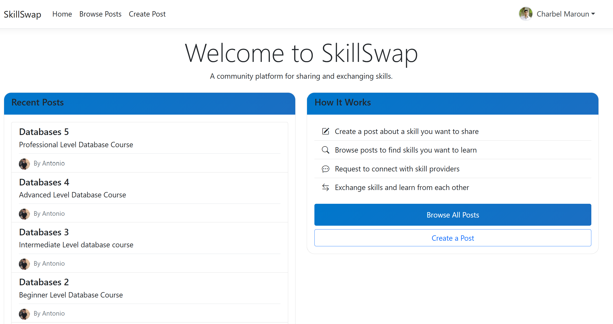

# SkillSwap 🔄

A community-driven platform that enables users to share and exchange skills with others, built with ASP.NET Core Razor Pages.

## Features ✨

- **User Authentication 🔒**
  - Register with email and password
  - Secure login with cookies authentication
  - Password hashing for security
  - User profile management

- **Profile Management 👤**
  - Personalized user profiles
  - Profile picture upload
  - Bio and personal information
  - Public profile pages for community visibility

- **Post System 📝**
  - Create posts offering skills to share
  - Upload images to illustrate posts
  - Browse all available posts
  - Search and filter posts by keywords
  - Sort posts by different criteria

- **Request System 🤝**
  - Send requests to post owners
  - Include messages with requests
  - Track request status (pending, accepted, rejected)
  - Review received requests for your posts

- **User Interaction 👥**
  - View other users' profiles
  - Browse skills offered by specific users
  - Direct communication through request system
  - Community-centered skill exchange

- **Responsive Design 📱**
  - Mobile-friendly interface
  - Bootstrap-based responsive layout
  - Consistent user experience across devices

## Tech Stack 🛠️

- **Backend**: ASP.NET Core 6.0 with Razor Pages
- **Database**: MySQL with Entity Framework Core
- **Frontend**: HTML, CSS, JavaScript
- **UI Framework**: Bootstrap 5 with Bootstrap Icons
- **Authentication**: Cookie-based authentication
- **Image Processing**: SixLabors.ImageSharp
- **Other Tools**: Entity Framework, MySqlConnector

## Getting Started 🚀

### Prerequisites

- .NET 6.0 SDK or later
- MySQL Server
- Visual Studio 2022 or Visual Studio Code

## Installation

Clone repository:
```bash
git clone <repo-url>
cd SkillSwap
```

## Dependencies Installation 📦

### Restore .NET dependencies
```bash
dotnet restore
```

## Database Setup 🗄️

1. Create a MySQL database named `skillswap`

2. Run the database creation script:
```bash
mysql -u your_username -p skillswap < Database/DB.sql
```

## Configuration ⚙️

1. Update the connection string in `appsettings.json`:
```json
{
  "ConnectionStrings": {
    "DefaultConnection": "Server=localhost;Database=skillswap;User=your_username;Password=your_password;"
  }
}
```

2. Create the uploads directory:
```bash
mkdir -p wwwroot/uploads/profiles
mkdir -p wwwroot/uploads/posts
```

## Starting the Application 🚀

### Using the .NET CLI:
```bash
dotnet run
```

### Using Visual Studio:
Open the solution file `SkillSwap.sln` and press F5 to run the application.

## Screenshots 📸

### Home Page

*Landing page showing recent posts and platform information*

### Browse Posts

*Interface for discovering and searching skills offered by the community*

### Post Details

*Detailed view of a skill offering with request option*

### User Profile

*User profile management with personal information and uploaded picture*

### My Posts

*Dashboard for managing your skill offerings*

### Request Management

*Interface for tracking and managing skill exchange requests*

## Features In Detail 📋

### Post System
Posts are the core of SkillSwap, allowing users to offer skills they're willing to share. Each post includes:
- Title and detailed description
- Optional image upload
- Author information
- Request management functionality

### Request System
When users find a skill they want to learn, they can send a request:
- Include a personalized message
- Track status (pending/accepted/rejected)
- View all incoming and outgoing requests
- Accept or reject requests for your posts

### User Profiles
Build your presence in the community:
- Customize your profile with a picture and bio
- View your posts and requests in one place
- Public profile visible to other users
- See other users' available skills